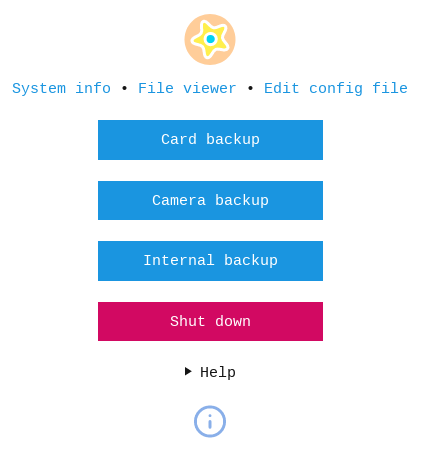

# Raspberry Pi Backup Box

This is a fork of the famous https://github.com/dmpop/little-backup-box from dmpop.

A bash shell scripts that transforms your Raspberry Pi (or any single-board computer running a Debian-based Linux distribution) into an inexpensive, fully-automatic, pocketable data backup device.

**IMPORTANT**
Little Backup Box is designed to work with USB sticks as backup media. Theoretically, it's possible to make Little Backup Box work with an external hard disk, but this setup is not officially supported.

## Installation

1. Create a bootable SD card with the latest version of Raspbian Lite for use with Little Backup Box.
2. Make sure that your Raspberry Pi is connected to the internet.
3. Run the following command on the Raspberry Pi: `curl -sSL https://raw.githubusercontent.com/danielschmalhofer/Raspberry_Pi_Backup_Bbox/master/install-little-backup-box.sh | bash`

Little Backup Box supports three backup modes:

- **Card backup** Automatically backs up the contents of a storage card to an external storage device.
- **Camera backup** Transfers photos, raw files, and videos from the camera connected directly to the Raspberry Pi. The transferred files are saved in the */home/pi/BACKUP/[CAMERA MODEL]* directory on the system storage card. **Important** Make sure that the camera is set to the MTP USB connection mode.
- **Remote control** Provides a simple web interface to manually choose one of the two modes described above.

During the installation, choose the desired mode from the selection dialog.

When prompted, reboot the Raspberry Pi.

## Usage

The exact steps depend on the operational mode.

### sync all data from one USB drive to another

1. Boot the Raspberry Pi
2. Plug in a backup storage device
3. Insert a storage card into a card reader and plug it into the Raspberry Pi
4. Wait till the Raspberry Pi shuts down

**Note:** To differentiate between different storage cards, the backup script creates a datetime-based *.id* file in the root of each storage card. The name of the *.id* file is also used as the destination backup folder on the storage device.

### backup your camera to the drive SD Card of this Pi

1. Boot the Raspberry Pi
2. Connect the camera to the Raspberry Pi
3. Turn the camera on
4. Wait till the Raspberry Pi shuts down

### remote control what I do my WIFI/LAN interface

# this still needs to be edited, I didn't change anything here

1. Point the browser to *http://[IP-ADDRESS]:8080* (replace *[IP-ADDRESS]* with the actual IP address of the Raspberry Pi)
2. Start the desired backup mode by pressing the appropriate button.

The remote control mode gives you access to the **Device backup** action that backs up the */home/pi/BACKUP* folder on the Raspberry Pi to an external storage device. This can be useful when you transfer files in the camera backup mode, and later want to back up the transferred files to a external storage device.

## Problems?

Please report bugs and issues in the [Issues](https://github.com/dmpop/little-backup-box/issues) section.

## Contribute

If you've found a bug or have a suggestion for improvement, open an issue in the [Issues](https://github.com/dmpop/little-backup-box/issues) section.

To add a new feature or fix issues yourself, follow the following steps.

1. Fork the project's repository repository
2. Create a feature branch using the `git checkout -b new-feature` command
3. Add your new feature or fix bugs and run the `git commit -am 'Add a new feature'` command to commit changes
4. Push changes using the `git push origin new-feature` command
5. Submit a pull request

## Author

Dmitri Popov [dmpop@linux.com](mailto:dmpop@linux.com)

## little changes in des description

danielschmalhofer.net

## License

The [GNU General Public License version 3](http://www.gnu.org/licenses/gpl-3.0.en.html)

<noscript></noscript>

## Linux Photography

Little Backup Box is a part of a streamlined and automated Linux-based photographic workflow described in the [Linux Photography](https://gumroad.com/l/linux-photography) book. The book provides step-by-step instructions on building a Raspberry Pi-based photo backup device running the Little Backup Box script. Get your copy at [Google Play Store](https://play.google.com/store/books/details/Dmitri_Popov_Linux_Photography?id=cO70CwAAQBAJ) or [Gumroad](https://gumroad.com/l/linux-photography).

