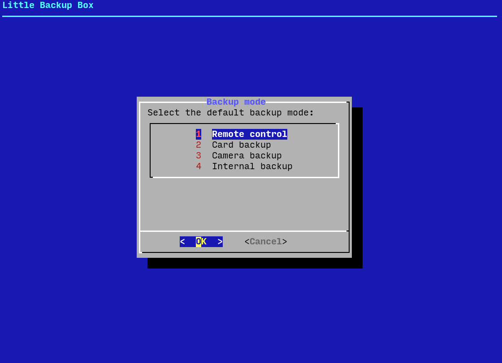
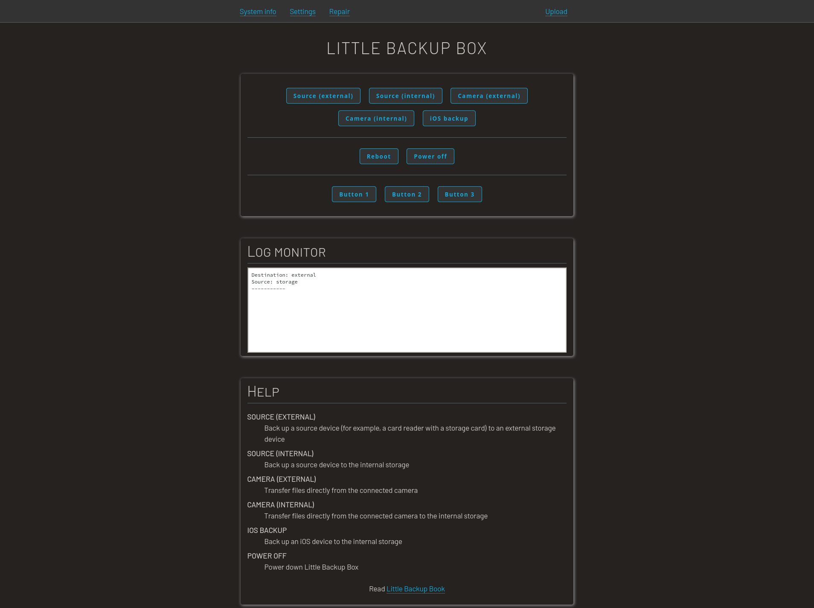

# Little Backup Box

Little Backup Box is an application that transforms a Raspberry Pi (or any single-board computer running a Debian-based Linux distribution) into an inexpensive, fully-automatic, pocketable backup device. While the primary purpose of Little Backup Box is to serve as a photo backup device, it's not limited to this specific usage scenario.

## Little Backup Box features

- Back up data from one USB storage device to another. Little Backup Box supports all types of USB solid-state storage devices and all popular formats.
- Transfer photos and RAW files directly from a camera to an external USB storage device. If your camera is supported by gPhoto2 software, it will work with Little Backup Box.
- Use multiple cards and storage devices. Little Backup Box assigns a unique ID to each storage device and create a separate folder for it on the backup drive.
- Perform backup automatically, without any user interaction.
- Use and control Little Backup Box via a web UI.
- Stream the backed up contents to any DLNA-compatible client.
- Access the backed up contents from other machines on the network.
- Manage files using a web-based file browser.
- Push backed up contents to a cloud storage service.

## Installation

1. Create a bootable SD card with the latest version of Raspberry Pi OS Lite for use with Little Backup Box.
2. Make sure that your Raspberry Pi is connected to the internet.
3. Run the following command on the Raspberry Pi: `curl -sSL https://raw.githubusercontent.com/dmpop/little-backup-box/main/install-little-backup-box.sh | bash`

Little Backup Box supports three backup modes:

- **Card backup** Automatically backs up the contents of a storage card to an external storage device.
- **Camera backup** Transfers photos, RAW files, and videos from the camera connected directly to the Raspberry Pi. The transferred files are saved in the _/home/pi/BACKUP/[CAMERA MODEL]_ directory on the system storage card. **Important** Make sure that the camera is set to the MTP USB connection mode.
- **Internal backup** Automatically backs up the contents of a storage card to the internal storage.

During the installation, choose the desired mode from the selection dialog.

When prompted, reboot the Raspberry Pi.

## Usage

The exact steps depend on the backup mode.

### web UI

The web UI allows you to control and manage Little Backup Box using any device with a browser. 

1. Point the browser to _http://127.0.0.1:8000_ (replace _127.0.0.1_ with the actual IP address of the Raspberry Pi).
2. Start the desired action by pressing the appropriate button.

- Use the **System info** navigation link to access basic system information, such as a list of storage devices and memory usage.
- To edit the configuration file, use the **Settings** navigation link.
- Use the **Upload** navigation link to switch to the upload form.

### Card backup mode

1. Boot the Raspberry Pi.
2. Plug in a backup storage device.
3. Insert a storage card into a card reader and plug it into the Raspberry Pi.
4. Wait till the Raspberry Pi shuts down.

**Note:** To differentiate between different storage cards, the backup script creates a datetime-based *.id* file in the root of each storage card. The name of the *.id* file is also used as the destination backup folder on the storage device.

### Camera backup mode

1. Boot the Raspberry Pi.
2. Connect the camera to the Raspberry Pi.
3. Turn the camera on.
4. Wait till the Raspberry Pi shuts down.

### Internal backup mode

1. Boot the Raspberry Pi.
2. Insert a storage card into a card reader and plug it into the Raspberry Pi.
3. Wait till the Raspberry Pi shuts down.

## Uninstall Little Backup Box

To uninstall Little Backup Box, run the following command:

    curl -sSL https://raw.githubusercontent.com/dmpop/little-backup-box/main/uninstall-little-backup-box.sh | bash
    
## Little Backup Book

The [Little Backup Book](https://gumroad.com/l/little-backup-book) book provides step-by-step instructions on building, configuring, using, and troubleshooting a Raspberry Pi-based backup device running Little Backup Box. Get your copy on [Google Play Store](https://play.google.com/store/books/details?id=VvrHDwAAQBAJ) or [Gumroad](https://gumroad.com/l/little-backup-book).

By buying the book, you are supporting the Linux Backup Box project.
## Problems, comments, ideas, updates?

To discuss Little Backup Box-related topics and get the latest updates, visit the [official forum at PIXLS.US](https://discuss.pixls.us/c/hardware/little-backup-box).

Please report bugs and issues in the [Issues](https://github.com/dmpop/little-backup-box/issues) section.

## Contribute

If you've found a bug or have a suggestion for improvement, open an issue in the [Issues](https://github.com/dmpop/little-backup-box/issues) section.

To add a new feature or fix issues yourself, follow the following steps.

1. Fork the project's repository repository.
2. Create a feature branch using the `git checkout -b new-feature` command.
3. Add your new feature or fix bugs and run the `git commit -am 'Add a new feature'` command to commit changes.
4. Push changes using the `git push origin new-feature` command.
5. Submit a pull request.

## Author

[Dmitri Popov](https://www.tokyoma.de/)

## Contributors

- Kerry Staite (STL files)
### I like coffee

<a href="https://paypal.me/dmpop" target="_blank">Buy me a coffee</a>, and I'll work even harder on Little Backup Box.

## License

The [GNU General Public License version 3](http://www.gnu.org/licenses/gpl-3.0.en.html)
